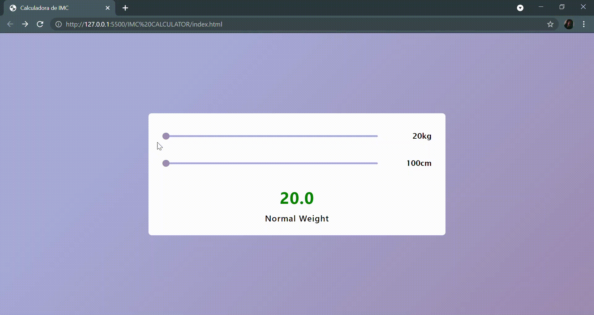

<h1>BMI Calculator</h1>
<h2>Project Description</h2>

Second Project used as an introduction to JavaScript, also using HTML5 and CSS3. Applying knowledge acquired in the Web (Java) programming course at Instituto PROA.

